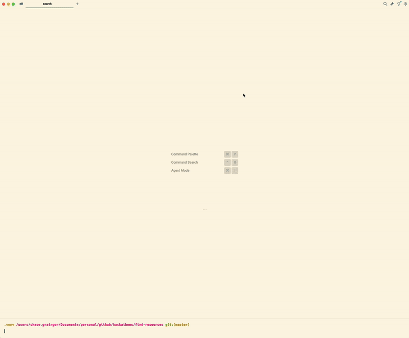

# 🎯 Tableau Search

- Created for a Tableau DataDev Quest.
- I figured I already interact with Tableau enough during my day job... why not do it for free?



---

## 🚀 Application Features

- **Multithreaded Searches**: Separated searches for all items onto their own threads for a little speed boost. May have been overkill.
- **Error Handling**: Added error handling with retries to ensure proper input from the user before continuing.
- **Rich Console Formatting**: To improve the overall CLI experience.
- **Native Paginators**: To ensure all possible results from Tableau are displayed.
- **Tabular Results**: To satisfy the developers with OCD...
- **Highlighted Search Terms**: Case-insensitive. I, too, forget what I searched for.
- **Optional Image Downloads**: Downloads view images and workbook preview images to a `downloads` directory. Completely optional.
- **Navigable View Urls**: So you can see your view in the browser.
- **Pass Search Term as Argument** Because it was an optional task ;)

---

## 🛠️ Running the Application

### 1. Ensure Python 3 is Installed

- The application is built with Python `3.11`.
- [Download Python](https://www.python.org/downloads/)

### 2. Create & Start the Virtual Environment

- Otherwise, if you try to use packages that aren't yet available:


- You can create the environment with:

```bash
python3 -m venv venv
```

- You can start the environment with:

```bash
source .venv/bin/activate
```

- And finally, install the necessary packages with:

```bash
pip install -r requirements.txt
```

### 3. Run the application.

- If you're using something like JetBrains, it may look a little funky.
- Native terminals work best. I'm biased towards [Warp](https://www.warp.dev/).

```bash
python3 main.py
```

### 4. Pass the search term as an argument (optional)

- I added this literally to accomplish an optional enhancement.
- I think passing the search term during program execution is more fun.
- BUT, if you wish to use it, usage looks like this:

```bash
python3 main.py "search term"
```

---

## 🔗 Useful Links

- [LinkedIn](https://www.linkedin.com/in/chase-grainger/)
- [Intermediate Quest](https://datadevquest.com/find-a-view-by-url/)
- [Python Tableau Client Documentation](https://tableau.github.io/server-client-python/docs/)
- [Tableau API Documentation](https://help.tableau.com/current/api/rest_api/en-us/REST/rest_api.htm)
- [PyPi](https://pypi.org/)